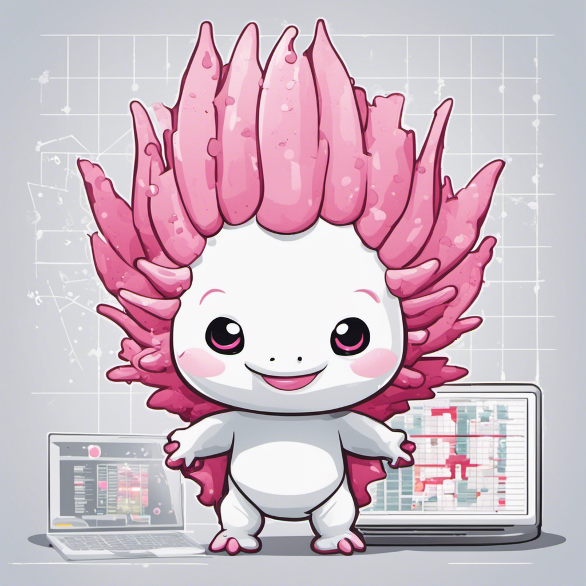

# Vector Database





## Overview

The Vector Database is a C++ project designed to store, manage, and access a collection of vectors. This database is optimized for high-dimensional data and supports efficient querying of vectors based on similarity measures, such as Euclidean distance and cosine similarity. It is ideal for applications including image recognition, natural language processing, and recommendation systems.

## Features

- **Efficient Storggage:** Utilizes advanced data structures for optimized storage and retrieval of large-scale vector data.
- **Similarity Search:** Enables similarity searches using various distance metrics.
- **Scalability:** Scales efficiently with growing data and query loads.
- **C++17 Standard:** Utilizes modern C++17 features for better performance and reliability.
- **CMake Build System:** Supports CMake for easy build system configuration and cross-platform support.

## Prerequisites

- A modern C++ compiler that supports C++17.
- [CMake](https://cmake.org/download/) version 3.10 or higher.

## Building the Project

1. **Clone the Repository**

   ```sh
   git clone https://github.com/yourusername/axodb.git
   ```

2. Navigate to the project directory:

    ```sh
    cd axoDb
    ```

3. Create a build directory and navigate to it:

    ```sh
    mkdir build && cd build
    ```

4. Run CMake and build the project:

    ```sh
    cmake ..
    make
    ```

## Usage

Provide instructions or code snippets on how to use your vector database library in C++ projects.

```cpp
#include "vector_db/vector_db.hpp"

int main() {
    // Example usage of VectorDB
}
```

## Documentation

Detailed documentation is available [here](link-to-documentation).

## Contributing

Contributions are welcome! Please read our [Contributing Guide](link-to-contributing-guide) for details on how to contribute and submit pull requests.

## License

VectorDB is licensed under the [GNU General Public License v3.0](LICENSE).

## Acknowledgements
